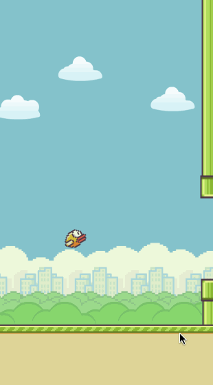

FlappyBird.spritebuilder
=======================

Learn how to build a Flappy Bird clone with SpriteBuilder and Cocos2d 3.0.

This two part tutorial will take you through the basics and then later introduce you 
to more advanced topics like infinitely scrolling parallax backgrounds and procedural 
level generation.
